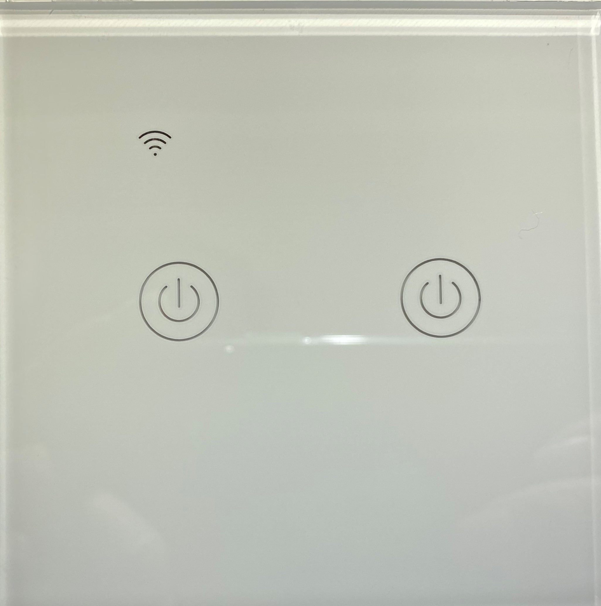
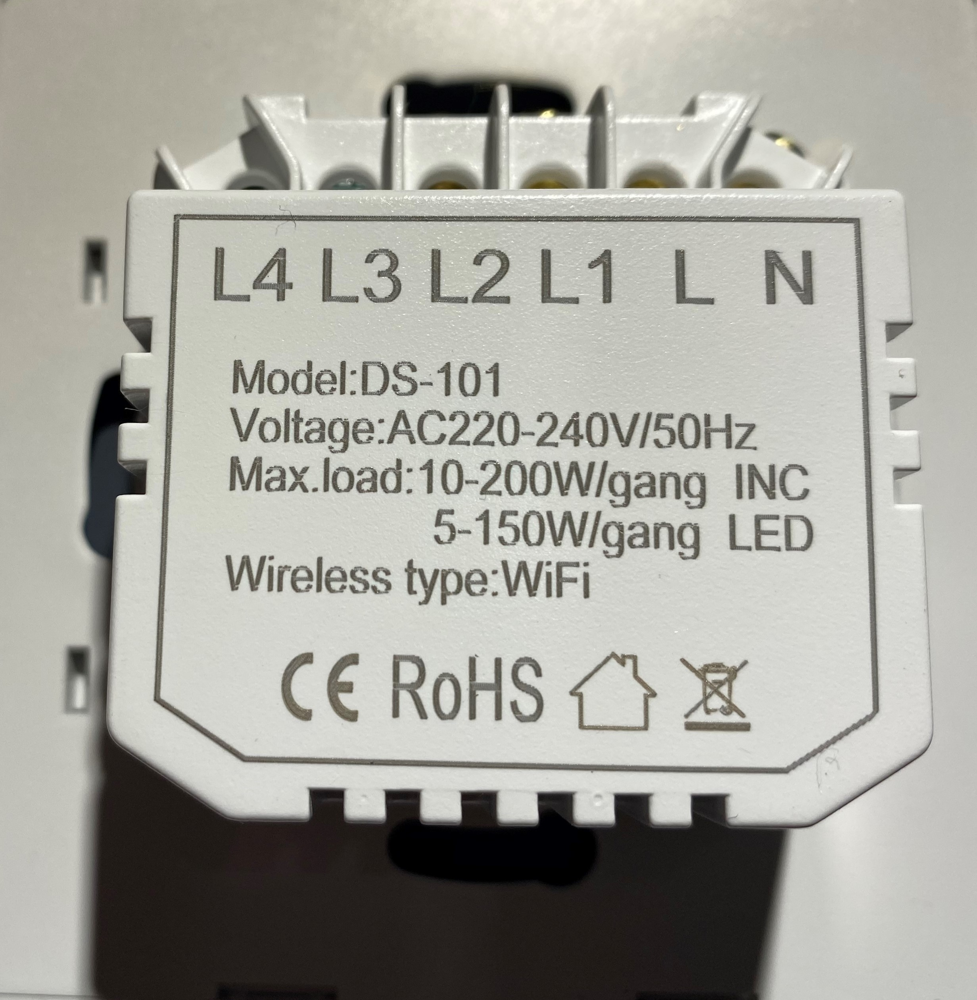
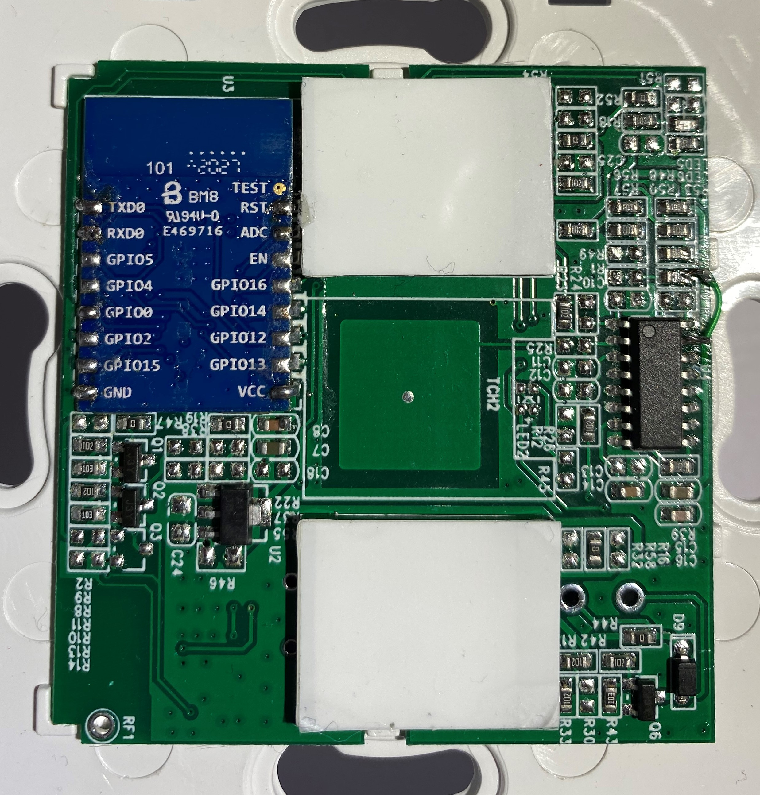

# smart-life-switch
## Re-flashing a Smart Life Switch with ESPHome for Home Assistant
The aim with all of my smart home devices is to use only my internal cloud to prevent sharing my activities with some unknown web site. I bought this Smart WiFi dual wall switch from https://www.aliexpress.com/. It is one of these clever ones that doesn't need a Neutral wire. 

  
  

At the time of writing, tuya-convert was broken because of a fix in the TUYA firmware, so hardware flashing was the only option.
I have done this many times, and, as the photo shows, the TYWE3S ESP8266 module is very exposed and easy to access for soldering. This should have been easy. 

  

I soldered wires to Tx, Rx, Vcc and GND. I connected GPIO0 to GND. Connected up to my USB-to-serial, but it wouldn't flash. I tried touching GND to the reset - nothing. I knew this was all I had to connect as I had flashed many TYWE3S modules before.

On using a terminal emulator set to 74880 baud I could see that the processor was going into boot mode. That meant Tx was functioning. I therefore determined that something must be affecting Rx.I probed about on the board with a continuity tester and found that several places were linked to Rx. Most hits were on the other side of the board to the ESP8266, so I figured there must be a track from Rx. I found two vias close to Rx. I scraped the solder resist off them and, sure enough, one was connected to Rx. The arrows on the photo indicate the via and the location where I cut the track. 

  

After a check with the continuity tester I tried flashing again and bingo! Success! I mended the track and all was well.

I ran various configs in ESPHome and found the pin allocation to be the same as a similar SONOFF device

| GPIO        | Description          |
| ----------- | ---------------------|
| 0           | WiFi Led             |
| 1           | Right Hand Blue LED  |
| 3           | Left Hand Button     |
| 4           | Output 1             |
| 5           | Right Hand Button    |
| 13          | Output 2             |
| 14          | Left Hand Blue LED   |

You can find the YAML in this repository. I don't link the buttons, leds and outputs together in ESPHome as I prefer the flexibility of doing that in Home Assistant.
